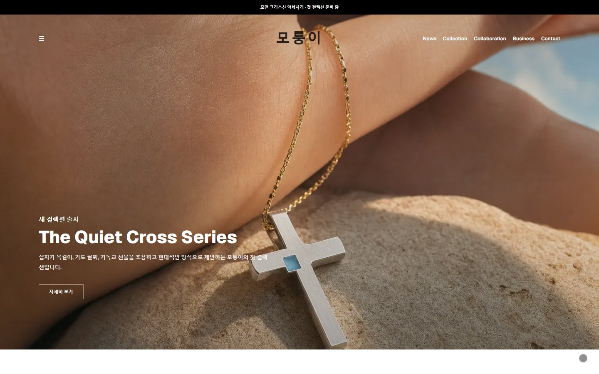
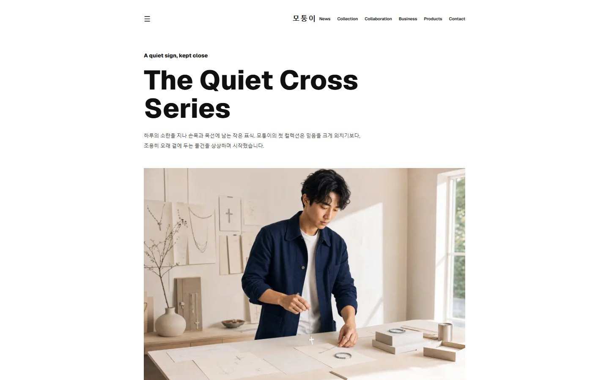
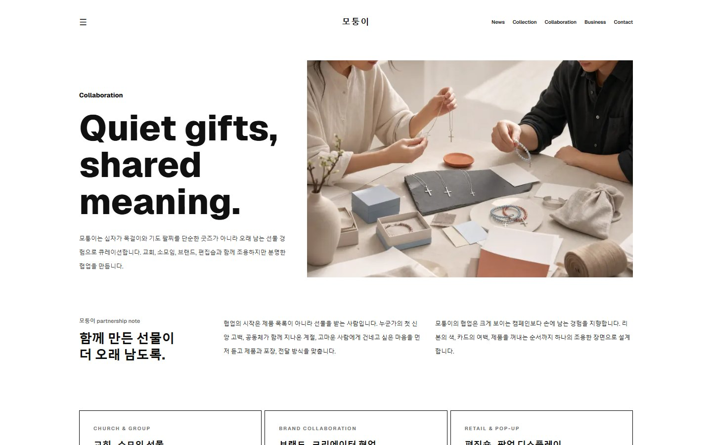
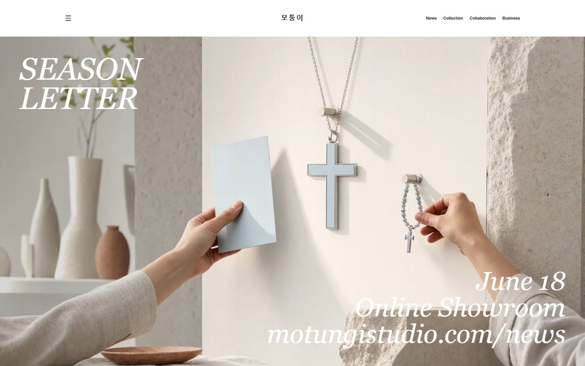
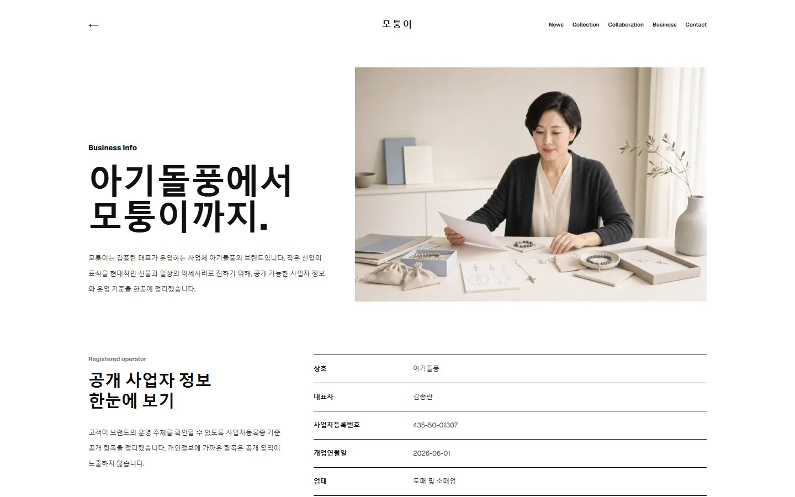
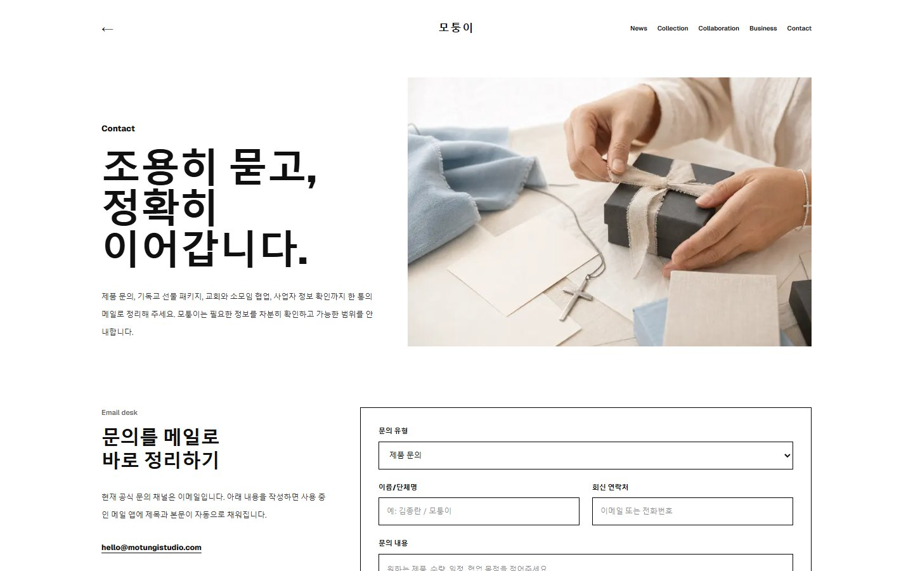

# 모퉁이

아기돌풍이 운영하는 감각적인 굿즈 공식스토어 `모퉁이`의 Next.js 랜딩/브랜드 사이트입니다. 의미 있는 악세사리, 선물 오브제, 협업 문의까지 하나의 조용한 구매 경험으로 정리했습니다.


- Live domain: [www.motungistudio.com](https://www.motungistudio.com)
- Canonical domain: [www.motungistudio.com](https://www.motungistudio.com)
- Apex redirect: [motungistudio.com](https://motungistudio.com) → [www.motungistudio.com](https://www.motungistudio.com)
- Original walkthrough video: [docs/media/moriah-walkthrough.webm](docs/media/moriah-walkthrough.webm)
- Verification report: [docs/media/verification-report.json](docs/media/verification-report.json)

## Project Overview

`모퉁이`는 기존 레퍼런스 사이트의 톤과 레이아웃 감각만 참고하고, 이미지와 콘텐츠는 모두 새 브랜드 콘셉트에 맞춰 재구성한 프로젝트입니다. 제품 자체가 크게 소리 내지 않는 대신, 여백과 촉감, 선물 맥락, 사업자 신뢰 정보를 차분하게 보여주는 방향으로 설계했습니다.

사업자 정보는 공개 가능한 항목만 사용합니다. 개인 주소에 가까운 정보는 사이트와 README에 포함하지 않았습니다.

## Pages

| Page | Purpose |
| --- | --- |
| `/` | 브랜드 첫 화면, 컬렉션 소개, 제품/서비스 요약, 비즈니스 요약 |
| `/collections` | The Quiet Cross Series 컬렉션 스토리와 제품 무드 |
| `/collaboration` | 교회, 소모임, 편집숍, 브랜드 협업 제안 |
| `/news` | 시즌 레터, 신제품 안내, 파트너 소식 |
| `/business` | 아기돌풍 공개 사업자 정보와 김종란 대표 스토리 |
| `/contact` | 제품/선물/협업/사업자 문의 작성 폼 |

## Screenshots

| Home | Collections |
| --- | --- |
|  |  |

| Collaboration | News |
| --- | --- |
|  |  |

| Business | Contact |
| --- | --- |
|  |  |

## Tech Stack

- Next.js `16.2.7`
- React `19.2.4`
- TypeScript
- Tailwind CSS v4
- App Router metadata, sitemap, robots, RSS, `llms.txt`
- GPT Image 2.0 generated brand/editorial assets
- Playwright-based visual walkthrough capture

## SEO & Metadata

The project includes:

- Route metadata for every major page
- `sitemap.xml`
- `robots.txt`
- `rss.xml`
- `llms.txt`
- favicon, manifest, OG/Twitter image settings
- Business-facing keywords for `모퉁이`, `모퉁이 굿즈`, `감각적인 굿즈`, `디자인 굿즈`, `오브젝트 브랜드`, `아기돌풍`, `김종란`, `선물 문의`

## Media Assets

Portfolio media is stored under [docs/media](docs/media):

- GIF preview: [docs/media/moriah-walkthrough.gif](docs/media/moriah-walkthrough.gif)
- Original WebM recording: [docs/media/moriah-walkthrough.webm](docs/media/moriah-walkthrough.webm)
- Page screenshots: [docs/media/screenshots](docs/media/screenshots)
- Automated verification report: [docs/media/verification-report.json](docs/media/verification-report.json)

The `webm` file is the reusable original recording for portfolio uploads or external editing. The `gif` file is optimized for quick README preview.

## Local Development

```bash
npm install
npm run dev
```

Open [http://localhost:3000](http://localhost:3000).

Production build:

```bash
npm run build
npm run start
```

## Verification

Latest local checks:

```bash
npm run lint
npm run build
```

The README media was generated by opening every public page, scrolling through it, capturing a WebM walkthrough, creating a GIF preview, and saving desktop screenshots for each route. The same run also checked for console/page errors and private-address leakage.

To regenerate media after design changes:

```bash
# In one terminal
npm run dev

# In another terminal
node scripts/capture-readme-media.mjs
python scripts/make-readme-gif.py
```

If Playwright is not installed in the project, install it temporarily or set `PLAYWRIGHT_NODE_PATH` to a `node_modules` directory containing `playwright`.
The capture script records a continuous browser scroll to WebM. The GIF script converts that original video with a full ffmpeg build, so the README preview keeps the same natural motion. Set `README_FFMPEG_PATH` when ffmpeg is not on PATH. You can tune pacing with `README_CAPTURE_SCROLL_PX_PER_SECOND` and GIF smoothness with `README_GIF_FPS`.

## Business Info

- Brand: `모퉁이`
- Operator: `아기돌풍`
- Representative: `김종란`
- Business registration: `435-50-01307`
- Business type: `도매 및 소매업`
- Business item: `해외직구대행업`
- Contact: `hello@motungistudio.com`

Private address fields are intentionally excluded from public documentation and site metadata.
